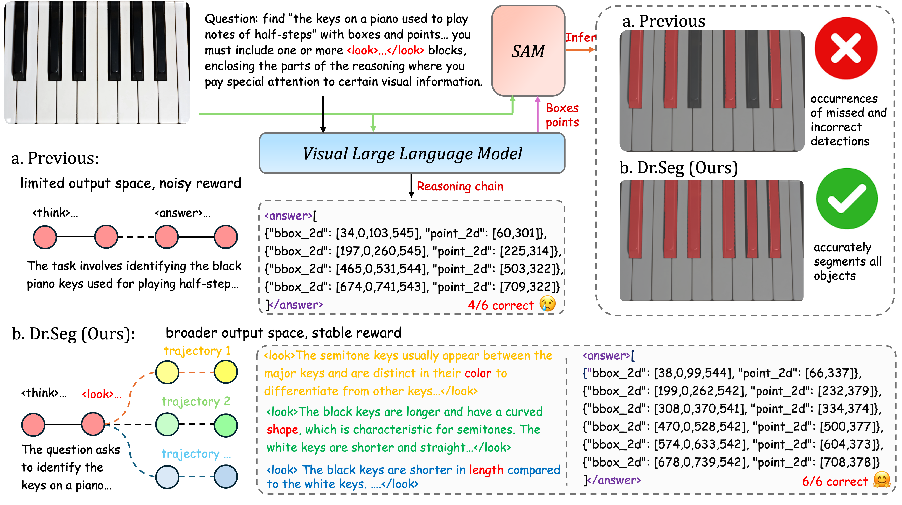

# Dr. Seg: Revisiting GRPO Training for Visual Large Language Models through Perception-Oriented Design

> We revisit GRPO training for visual segmentation and detection and propose Dr. Seg, a simple plug-and-play framework featuring a Look-to-Confirm mechanism and a Distribution-Ranked Reward module. It requires no architectural modifications and integrates seamlessly with existing GRPO-based VLLMs. Extensive experiments show that Dr. Seg improves performance in complex visual scenarios while preserving strong generalization.

Paper: [📖 Dr.Seg](https://arxiv.org/abs/2603.00152)        
Model: [🤗 Dr.Seg-7B](https://huggingface.co/hao05/Dr_Seg)  
Dataset: [🤗 COCONut(WIP)]()

Overview of Dr. Seg:
<div align=center>

</div>

## TODO
- [x] Release checkpoint
- [x] Renew README
- [x] Release training code
- [ ] Release more evaluation code
- [ ] Release dataset

## Installation
```bash
git clone https://github.com/eVI-group-SCU/Dr-Seg
cd Dr-Seg
conda create -n drseg python=3.12
conda activate drseg
pip install torch==2.6.0 torchvision==0.21.0
pip install -e .
```

## Training
>[!NOTE]
>We recommend using 4×80GB GPUs and at least 500GB of RAM.  
>As a reference, it takes approximately 15 hours to run ~500 training steps on 4× H800 PCIe.  
>Training Data (thanks to VisionReasoner): [🤗 MultiObject-7K](https://huggingface.co/datasets/Ricky06662/VisionReasoner_multi_object_7k_840)   

(1) Download the dataset using this script: 
```bash
python training_scripts/download_dataset.py
```

(2) Download the pretrained model using the following commands:
```bash
mkdir pretrained_models
cd pretrained_models
git lfs install
git clone https://huggingface.co/Qwen/Qwen2.5-VL-7B-Instruct
```

(3) Modify ```trainer.save_checkpoint_path``` in ``` training_scripts/run_drseg_7b_4x80G.sh```: 
```bash
trainer.save_checkpoint_path=your_path_to_checkpoint/${RUN_NAME}
``` 

(4) Start Distribution-Ranked Reward module:
```bash
python -u drr_module/serve.py --host 127.0.0.1 --port 50070 
```

>[!NOTE]
>Remember to configure Weights & Biases (wandb) correctly to upload training logs.

(5) Start training in another terminal using this script:
```bash
bash training_scripts/run_drseg_7b_4x80G.sh
```
> [!NOTE]
> We recommend running training for 400–600 steps.

(6) Merge Checkpoint in Hugging Face Format:
```bash
python3 training_scripts/model_merger.py --local_dir [path_to_your_actor_checkpoint]
```

## Evaluation  

>[!NOTE]
>Evaluation Data (thanks to VisionReasoner):  
>[🤗 ReasonSeg-Val](https://huggingface.co/datasets/Ricky06662/ReasonSeg_val) [🤗 ReasonSeg-Test](https://huggingface.co/datasets/Ricky06662/ReasonSeg_test)  
>[🤗 refcoco_val](https://huggingface.co/datasets/Ricky06662/refcoco_val) [🤗 refcoco_testA](https://huggingface.co/datasets/Ricky06662/refcoco_testA)  
>[🤗 refcocoplus_val](https://huggingface.co/datasets/Ricky06662/refcocoplus_val) [🤗 refcocoplus_testA](https://huggingface.co/datasets/Ricky06662/refcocoplus_testA)  
>[🤗 refcocog_val](https://huggingface.co/datasets/Ricky06662/refcocog_val) [🤗 refcocog_testA](https://huggingface.co/datasets/Ricky06662/refcocog_testA)  


## Citation
```bibtex
@article{sun2026dr,
  title={Dr. Seg: Revisiting GRPO Training for Visual Large Language Models through Perception-Oriented Design},
  author={Sun, Haoxiang and Wang, Tao and Tang, Chenwei and Yuan, Li and Lv, Jiancheng},
  journal={arXiv preprint arXiv:2603.00152},
  year={2026}
}
```

## Acknowledgements

This project builds upon several open-source efforts, including [VisionReasoner](https://github.com/JIA-Lab-research/VisionReasoner), [Seg-Zero](https://github.com/JIA-Lab-research/Seg-Zero), [EasyR1](https://github.com/hiyouga/EasyR1), [veRL](https://github.com/volcengine/verl), and [COCONut-PanCap](https://github.com/bytedance/coconut_cvpr2024). We also utilize pretrained models from [Qwen2.5-VL](https://huggingface.co/Qwen/Qwen2.5-VL-7B-Instruct) and [SAM2](https://huggingface.co/facebook/sam2-hiera-large). We sincerely thank the authors and maintainers for releasing high-quality code and models, providing clear documentation and reproducible pipelines, and actively maintaining these projects, which significantly facilitated our implementation and evaluation.


